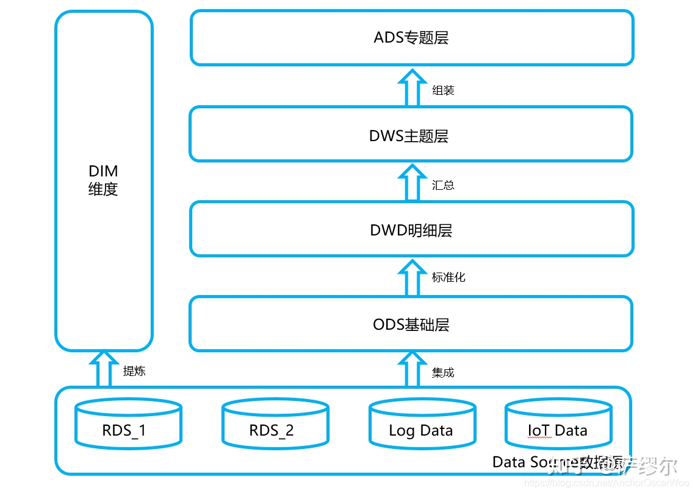
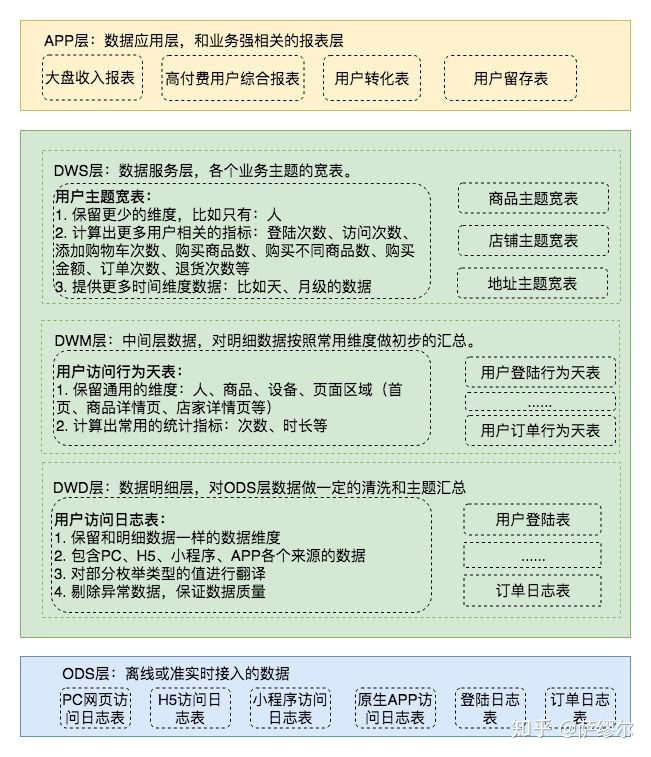

# 数仓建设基本概念

今天我们就简单说下数据分析师需要了解的数据仓库基础知识，其结构如下所示：

## 一、何为数据仓库

1. 数仓是什么, 其实就是存储数据,体现历史变化的一个数据仓库. 因为互联网时代到来,基于数据量的大小,分为了传统数仓和现代数仓.
2. 传统数仓,使用传统的关系型数据库进行数据存储,因为关系型数据库本身可以使用SQL以及函数等做数据分析.所以把数据存储和数据分析功能集合为一体,加上一个可视化界面,就能从数据存储,数据分析,数据展示完整方案.
3. 到了互联网时代,由于上网用户剧增,特别是移动互联网时代,海量的网络设备,导致了海量的数据产生,企业需要也希望从这些海量数据中挖掘有效信息,如行为日志数据,业务数据,爬虫数据等等中提炼出有价值信息.但传统的关系型数据库由于本身技术限制,无法很好承担这么大数据量存储和分析的任务,现代大数据技术应运而生.而数仓就是做这些海量数据存储的地方.

## 二、为何数据仓库要分层
数据分层是数据仓库设计中十分重要的一个环节，优秀的分层设计能够让整个数据体系更易理解和使用。而目前网络中大部分可以被检索到相关文章只是简单地提及数据分层的设计，或缺少明确而详细的说明，或缺少可落地实施的方案，或缺少具体的示例说明。

1. `清晰数据结构`：每一个数据分层都有它的作用域和职责，在使用表的时候能更方便地定位和理解
2. `减少重复开发`：规范数据分层，开发一些通用的中间层数据，能够减少极大的重复计算
3. `统一数据口径`：通过数据分层，提供统一的数据出口，统一对外输出的数据口径
4. `复杂问题简单化`：将复杂的任务分解成多个步骤来完成，每一层只处理单一的步骤，比较简单和容易理解。当数据出现问题之后，不用修复所有的数据，只需要从有问题的步骤开始修复。
5. `屏蔽原始数据的异常`：不必改一次业务就需要重新接入数据。

## 三、数据仓库分层的含义

### 1、数据运营层：ODS（Operational Data Store）

“面向主题的”数据运营层，也叫ODS层，是最接近数据源中数据的一层，数据源中的数据，经过抽取、洗净、传输，也就说传说中的 ETL 之后，装入本层。本层的数据，总体上大多是按照源头业务系统的分类方式而分类的。

一般来讲，为了考虑后续可能需要追溯数据问题，因此对于这一层就不建议做过多的数据清洗工作，原封不动地接入原始数据即可，至于数据的去噪、去重、异常值处理等过程可以放在后面的DWD层来做。

`ODS层数据还起到一个数据备份作用,如果是比较特殊行业,在ODS层的数据会保留一年甚至多年.不过普通公司一般就保存3–6个月,看数据量和存储压力以及存储预算决定.`

日志数据估算,如日活100万用户,每个用户访问1次,每次操作5min,每个用户平均3秒一条日志数据,一条数据1kb.最后体积是100w*1*5*60/3*1kb=100w*100kb=97656.25MB=95.36GB;

### 2、数据仓库层：DW（Data Warehouse）

数据仓库层是我们在做数据仓库时要核心设计的一层，在这里，从 ODS 层中获得的数据按照主题建立各种数据模型。DW层又细分为 DWD（Data Warehouse Detail）层、DWM（Data WareHouse Middle）层和DWS（Data WareHouse Service）层。

#### a. 数据明细层：DWD（Data Warehouse Detail）

该层一般保持和ODS层一样的数据粒度，并且提供一定的数据质量保证。同时，为了提高数据明细层的易用性，该层会采用一些维度退化手法，将维度退化至事实表中，减少事实表和维表的关联。

另外，在该层也会做一部分的数据聚合，将相同主题的数据汇集到一张表中，提高数据的可用性，后文会举例说明。

#### b. 数据中间层：DWM（Data WareHouse Middle）

该层会在DWD层的数据基础上，对数据做轻度的聚合操作，生成一系列的中间表，提升公共指标的复用性，减少重复加工。

直观来讲，就是对通用的核心维度进行聚合操作，算出相应的统计指标。

#### c. 数据服务层：DWS（Data WareHouse Service）

又称数据集市或宽表。按照业务划分，如流量、订单、用户等，生成字段比较多的宽表，用于提供后续的业务查询，OLAP分析，数据分发等。

一般来讲，该层的数据表会相对比较少，一张表会涵盖比较多的业务内容，由于其字段较多，因此一般也会称该层的表为宽表。

在实际计算中，如果直接从DWD或者ODS计算出宽表的统计指标，会存在计算量太大并且维度太少的问题，因此一般的做法是，`在DWM层先计算出多个小的中间表，然后再拼接成一张DWS的宽表。`由于宽和窄的界限不易界定，也可以去掉DWM这一层，只留DWS层，将所有的数据在放在DWS亦可。

### 3、数据应用层：ADS（Application Data Store）
在这里，主要是提供给数据产品和数据分析使用的数据，一般会存放在 ES、PostgreSql、Redis等系统中供线上系统使用，也可能会存在 Hive 或者 Druid 中供数据分析和数据挖掘使用。比如我们经常说的报表数据，一般就放在这里。

## 参考资料
* [数据分析师面试相关：数据仓库相关](https://zhuanlan.zhihu.com/p/341377274)